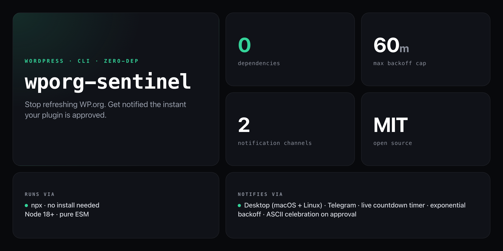

<div align="center">

**Stop refreshing WP.org. Get an instant notification the moment your plugin goes live.**


</div>

---

The WP.org review queue takes 10–14 days. Most developers end up checking the queue manually every 20 minutes, at all hours. `wporg-sentinel` polls the Plugin Info API on your behalf — with exponential backoff, a live countdown timer, and instant desktop + Telegram notifications the moment your plugin is approved.

```
┌─────────────────────────────────────────────────────────┐
│  wporg-sentinel — WP.org Plugin Approval Monitor        │
└─────────────────────────────────────────────────────────┘

  Plugin: my-awesome-plugin
  API:    https://api.wordpress.org/plugins/info/1.2/

  #    Time              Status           Next check in
  ─────────────────────────────────────────────────────
    1  14:32:05           ○ pending...      ~30m
    2  15:02:05           ○ pending...      ~60m
  ⏱  Next poll in: 58m 47s    (Ctrl+C to exit)
```

On approval:

```
╔══════════════════════════════════════════════════════════╗
║  🎉  PLUGIN APPROVED!  🎉                                ║
╚══════════════════════════════════════════════════════════╝

  Plugin:   My Awesome Plugin
  Slug:     my-awesome-plugin
  Version:  1.0.0
  URL:      https://wordpress.org/plugins/my-awesome-plugin/
```

## Install

No npm account needed — runs straight from GitHub with zero dependencies:

```bash
npx github:NickCirv/wporg-sentinel --slug your-plugin-slug
```

Or clone and run locally:

```bash
git clone https://github.com/NickCirv/wporg-sentinel
cd wporg-sentinel
node index.js --slug your-plugin-slug
```

## Usage

```bash
npx github:NickCirv/wporg-sentinel --slug <plugin-slug> [options]
```

| Flag | Description |
|------|-------------|
| `--slug <slug>` | Plugin slug to watch — required |
| `--interval <minutes>` | Initial poll interval in minutes (default: `15`) |
| `--telegram <token:chatId>` | Telegram bot token and chat ID for mobile notifications |
| `--help`, `-h` | Show help |

### Examples

```bash
# Watch a plugin with default 15-minute interval
npx github:NickCirv/wporg-sentinel --slug my-awesome-plugin

# Check every 10 minutes initially
npx github:NickCirv/wporg-sentinel --slug my-awesome-plugin --interval 10

# With Telegram notifications
npx github:NickCirv/wporg-sentinel --slug my-awesome-plugin --telegram YOUR_BOT_TOKEN:123456789
```

## How it works

1. Hits `https://api.wordpress.org/plugins/info/1.2/` with your plugin slug
2. `slug` field present in response → plugin is **LIVE** → fires all notifications
3. `error` field present → not yet approved → waits and retries
4. **Exponential backoff**: interval doubles after each check, caps at 60 minutes
   - Default: `15m → 30m → 60m → 60m → …`
   - With `--interval 5`: `5m → 10m → 20m → 40m → 60m → …`
5. On approval: desktop notification + Telegram message (if configured) + ASCII celebration screen

## Telegram setup

1. Message [@BotFather](https://t.me/BotFather), create a bot, copy the token
2. Get your chat ID from [@userinfobot](https://t.me/userinfobot)
3. Pass both as `--telegram TOKEN:CHAT_ID`

```bash
npx github:NickCirv/wporg-sentinel --slug my-plugin --telegram YOUR_BOT_TOKEN:123456789
```

The notification message:

```
🛡️ wporg-sentinel

✅ My Awesome Plugin is now LIVE on WordPress.org!

https://wordpress.org/plugins/my-awesome-plugin/
```

## What it is NOT

- **Not a plugin submission tool.** It monitors an already-submitted plugin — the submission itself still goes through the WP.org review portal.
- **Not a guarantee of coverage.** Approval detection relies entirely on the Plugin Info API returning a `slug` field. If the API is down or slow, checks will time out gracefully and retry.
- **Not a background service.** It runs in your terminal for as long as you leave it open. Use a multiplexer like `tmux` or `screen` if you need it to persist across terminal sessions.

---

<div align="center">
<sub>Zero dependencies · Node 18+ · MIT · by <a href="https://github.com/NickCirv">NickCirv</a></sub>
</div>
