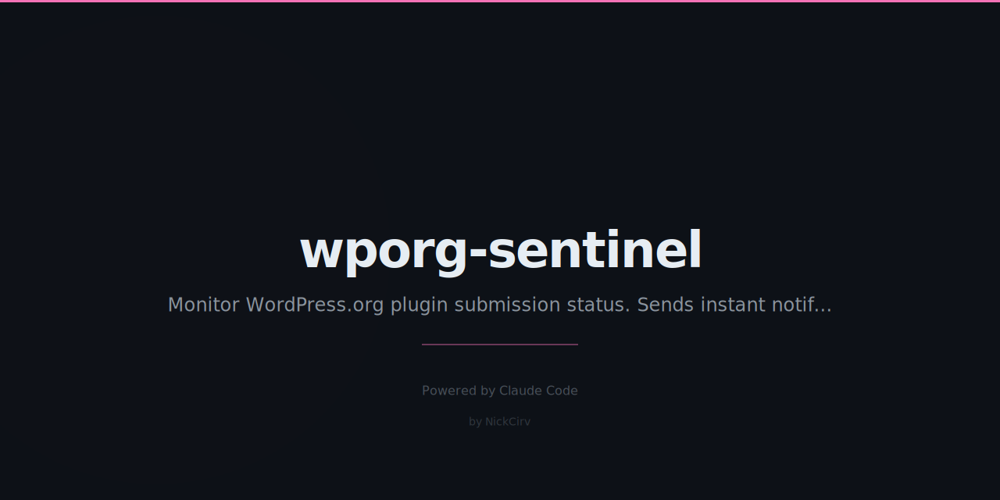

# wporg-sentinel 🛡️

Stop refreshing WP.org like a maniac.

You submitted your plugin. Now you're checking the review queue every 20 minutes at 2am.
Stop. This does it for you.


---

## What it does

- Polls the WP.org Plugin Info API on a configurable interval
- Exponential backoff — starts at your interval, doubles each attempt, caps at 60 minutes
- Live countdown timer in terminal (same line, no scroll spam)
- Running history table of every check attempt
- Desktop notification the moment your plugin goes live (macOS + Linux)
- Optional Telegram notification so you get pinged wherever you are
- Big ASCII celebration on approval
- Graceful exit (Ctrl+C) with session summary

---

## Install

### Run directly with npx (no install needed)

```bash
npx wporg-sentinel --slug your-plugin-slug
```

### Or clone and run with node

```bash
git clone https://github.com/NickCirv/wporg-sentinel
cd wporg-sentinel
node index.js --slug your-plugin-slug
```

No dependencies. Pure Node.js ES modules. Works with Node >=18.

---

## Usage

```
node index.js --slug <plugin-slug> [options]

Options:
  --slug <slug>              Plugin slug to watch (required)
  --interval <minutes>       Initial poll interval in minutes (default: 15)
  --telegram <token:chatId>  Telegram bot token and chat ID for notifications
  --help, -h                 Show help
```

### Examples

```bash
# Watch a plugin, check every 15 minutes (default)
node index.js --slug my-awesome-plugin

# Check every 10 minutes initially
node index.js --slug my-awesome-plugin --interval 10

# With Telegram notifications
node index.js --slug my-awesome-plugin --telegram 123456789:AABBabcd_TOKEN:987654321

# Using npx
npx wporg-sentinel --slug my-awesome-plugin --interval 20
```

---

## How it works

1. Hits `https://api.wordpress.org/plugins/info/1.2/?action=plugin_information&request[slug]=YOUR_SLUG`
2. If the response has a `slug` field → your plugin is **LIVE**
3. If the response has an `error` field → not yet approved, wait and retry
4. **Exponential backoff**: interval doubles after each check, caps at 60 minutes
   - Default: 15min → 30min → 60min → 60min → ...
   - With `--interval 5`: 5min → 10min → 20min → 40min → 60min → ...
5. On approval: desktop notification + Telegram (if configured) + ASCII party

The WP.org review queue typically takes 10-14 days. This tool will wake you up the moment it's done — not when you happen to refresh.

---

## Telegram Setup

1. Message [@BotFather](https://t.me/BotFather) on Telegram, create a bot, copy the token
2. Get your chat ID by messaging [@userinfobot](https://t.me/userinfobot)
3. Pass both as `--telegram TOKEN:CHAT_ID`

```bash
node index.js --slug my-plugin --telegram YOUR_BOT_TOKEN:123456789
```

The notification will look like:
```
🛡️ wporg-sentinel

✅ My Awesome Plugin is now LIVE on WordPress.org!

https://wordpress.org/plugins/my-awesome-plugin/
```

---

## Terminal output

```
┌─────────────────────────────────────────────────────────┐
│  wporg-sentinel — WP.org Plugin Approval Monitor        │
└─────────────────────────────────────────────────────────┘

  Plugin: my-awesome-plugin
  API:    https://api.wordpress.org/plugins/info/1.2/

  #    Time              Status           Next check in
  ─────────────────────────────────────────────────────
    1  14:32:05           ○ pending...      ~30m
    2  15:02:05           ○ pending...      ~60m
  ⏱  Next poll in: 58m 47s    (Ctrl+C to exit)
```

On approval:
```
╔══════════════════════════════════════════════════════════╗
║  🎉  PLUGIN APPROVED!  🎉                                ║
╚══════════════════════════════════════════════════════════╝

  Plugin:   My Awesome Plugin
  Slug:     my-awesome-plugin
  Version:  1.0.0
  URL:      https://wordpress.org/plugins/my-awesome-plugin/
```

---

## Why not just a cron job?

You could set up a cron job. But then you'd need to write the script, handle the API response parsing, wire up notifications, manage the backoff, and debug why it's not working at 3am.

This is that script. Ready to run.

---

## License

MIT — use it, fork it, ship it.

Built by [NickCirv](https://github.com/NickCirv). Born from the pain of waiting for WP.org approvals.
